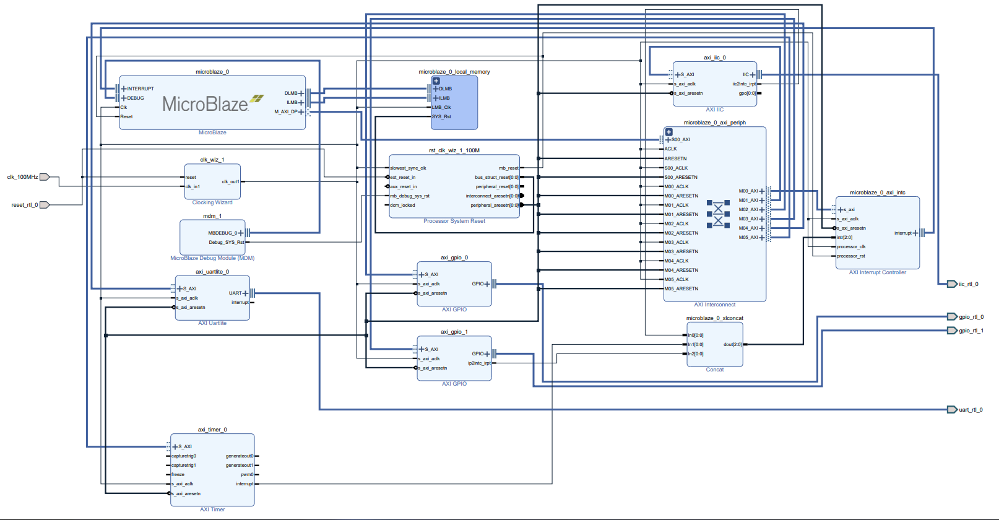
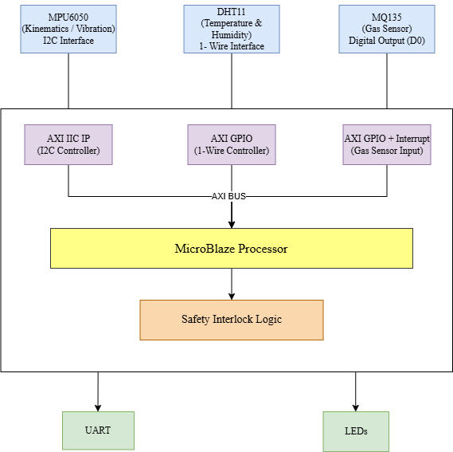

# SKILL LAB PRACTICAL HACKATHON 

## 1. Team Identity 

### 1.1 Studio / Group Name 
**Innovators**

### 1.2 Team Members 

| Name | Primary Role | Secondary Role | Strengths Brought to the Project |
| :--- | :--- | :--- | :--- |
| **Soham Mayekar** | Hardware Block Design / Vivado | Software | FPGA Architecture, AXI Interconnects, Presenting |
| **Prince Eppakayal** | Software / Vitis C Code | Documentation | Bare-metal C programming, Sensor Logic |
| **Swarnima Jahagirdar** | Debugging, Testing | Documentation | Wiring, Sensor Calibration, Hardware Debugging |
| **Priyanka Tiwari** | Integration | | Integration of hardware and software modules |

### 1.3 Project Title 
**"Autonomous Paint Booth Safety & Quality Controller"**

### 1.4 One-Line Pitch 
A System-on-Chip (SoC) embedded controller utilizing true hardware concurrency to ensure quality and safety in highly volatile automotive paint booths. 
 
### 1.5 Expanded Project Idea 
In modern automotive manufacturing, automated paint booths are highly volatile environments requiring strict atmospheric control for paint adherence and posing explosive hazards due to Volatile Organic Compounds (VOCs). This project implements an Autonomous Paint Booth Safety & Quality Controller utilizing a Spartan-7 FPGA. 

By employing a Hardware/Software Co-design methodology, we synthesized a custom System-on-Chip (SoC) centered around the Xilinx MicroBlaze soft processor. Dedicated hardware IP blocks handle the strict microsecond timing and digital safety interrupts, while the MicroBlaze processor acts as a deterministic decision engine. The system continuously polls kinematic data (MPU6050) to predict robotic arm failures, monitors curing temperatures (DHT11), and utilizes a zero-latency digital hardware interrupt from the gas sensor (MQ135) to instantly halt the system if an explosive threshold is reached.

---

## 2. Inspiration 

### 2.1 References 

| Source Type / Link | Title | What Inspired You |
| :--- | :--- | :--- |
| [Web Link](https://www.osha.gov/spray-operations/standards) | **OSHA Industrial Paint Booth Safety Guidelines** | The strict requirement for instantaneous ventilation and power-cutoff during VOC leaks. |
| [Video Link](https://youtu.be/1prlAjndla8?si=bT3wWNWVGYPbZMcQ) | **Hardware/Software Co-Design in FPGAs** | Visualizing the kinematics of an industrial painting robot and its enclosed environment, justifying the need for our MPU6050 and MQ135 safety interlocks. |

### 2.2 Original Twist 
Unlike standard microcontroller projects that poll sensors sequentially in a "while" loop (introducing dangerous software latency), our twist is **"Zero-Latency Hardware Interlocks."** We decoupled the explosive gas detection from the main processor's math loop. By routing the MQ135's digital interrupt pin through an AXI GPIO directly to the MicroBlaze, we guarantee an immediate, deterministic hardware halt the millisecond a VOC leak occurs, simulating true industrial-grade safety. 

---

## 3. Project Intent 

### 3.1 User Journey 
A factory supervisor powers on the system, and the Spartan-7 FPGA configures the MicroBlaze SoC. The supervisor monitors the serial dashboard as the robotic arm begins painting. The DHT11 verifies the booth is at an optimal 22°C for the clear coat to cure. Suddenly, the exhaust fan fails, and VOCs from the paint thinner rapidly accumulate in the booth. Before the supervisor can react, the MQ135 detects the lower explosive limit. Instantly, the hardware comparator sends a digital interrupt via AXI GPIO. The MicroBlaze immediately cuts the power relay to the robotic arm, preventing a spark and an explosion, while flashing a critical system halt alert. 

---

## 4. Definition of Success 

### 4.1 Definition of “Usable” 
The system successfully synthesizes the bitstream, the MicroBlaze runs the C application, and all three sensors (DHT11, MQ135, MPU6050) report accurate data to the serial monitor without the I2C or AXI buses crashing. 

### 4.2 Minimum Usable Version 
The MQ135 and DHT11 operating concurrently. If the digital pin on the MQ135 goes HIGH, the MicroBlaze instantly triggers a "HALT" state on an output LED/Relay. 

### 4.3 Stretch Features 
Incorporating an Ultrasonic sensor and an IR sensor to act as secondary spatial safety checks, preventing the robotic arm from colliding with the vehicle chassis or entering human blind spots. 

---

## 5. System Overview 

### 5.1 Project Type 
- [x] Electronics-based 
- [ ] Mechanical 
- [x] Sensor-based 
- [x] App-connected (Serial/UART Dashboard) 
- [ ] Motorized 
- [ ] Sound-based 
- [ ] Light-based (Status LEDs) 
- [ ] Screen/UI-based 
- [ ] Fabricated structure 
- [x] Game logic based (State Machine Logic) 
- [ ] Installation 
- [ ] Other: 

### 5.2 High-Level System Description 
* **Inputs:** DHT11 (Temperature/Humidity via 1-wire), MQ135 (VOC Gas via Digital Comparator), MPU6050 (Kinematics via I2C). 
* **Processing:** A Spartan-7 FPGA running a custom MicroBlaze soft-processor. Hardware IP blocks handle the electrical protocols (AXI IIC, AXI GPIO). The MicroBlaze evaluates the states deterministically in a bare-metal C application.
* **Output:** Physical GPIO outputs mapped to LEDs indicating SYSTEM SAFE, QUALITY WARNING, or EMERGENCY HALT. 

### 5.3 Input / Output Map 

| System Part | Type | What It Does |
| :--- | :--- | :--- |
| **DHT11** | Input | Monitors booth temp/humidity for paint curing quality |
| **MQ135 (Digital Pin)** | Input | Hardware comparator that goes HIGH if explosive gas limits are reached |
| **MPU6050** | Input | Monitors robotic arm for micro-vibrations indicating mechanical failure |
| **AXI GPIO / LEDs** | Output | Triggers physical safety relays/indicators based on system state |
| **MicroBlaze UART** | Output | Transmits real-time system status to the supervisor's laptop |

---

## 6. System Design, Sketches and Visual Planning 

### 6.1 Concept Architecture / Schematic

### 6.2 Labeled Build Sketch/ Architecture/ Flow diagram/ Algorithm

### 6.3 Approximate Dimensions

* Not Applicable

# 7. Electronics Planning

## 7.1 Electronics Used

| **Component** | **Quantity** | **Purpose** | 
| :--- | :--- | :--- | 
| Spartan-7 FPGA Board | 1 | Main controller (MicroBlaze SoC) | 
| MPU6050 | 1 | Detect vibration / motion (I2C) | 
| MQ135 Gas Sensor | 1 | Detect harmful gases (digital interrupt) | 
| DHT11 | 1 | Measure temperature/humidity | 
| USB Cable | 1 | Programming + serial communication | 
| Jumper Wires | Multiple | Connections | 

## 7.2 Wiring Plan

The Spartan-7 FPGA board acts as the central controller running a MicroBlaze soft processor. The MPU6050 sensor is interfaced using the AXI IIC IP core, with its SDA and SCL lines connected to the FPGA I2C pins.

The DHT11 and MQ135 sensors are connected using AXI GPIO. The DHT11 uses a single data pin requiring timing-based communication, while the MQ135 provides a digital HIGH signal when gas levels exceed a threshold.

The MQ135 is also connected to the AXI Interrupt Controller through GPIO, enabling a direct interrupt signal to the MicroBlaze for immediate response.

LEDs are connected via GPIO pins to indicate system states such as SAFE, WARNING, or EMERGENCY HALT.

UART is used for serial communication between the FPGA and a PC for monitoring system status.

## 7.3 Circuit Diagram/architecture diagram

Insert a hand-drawn or software-made circuit diagram.

*Insert image below:*

[Upload image and link here]

## 7.4 Power Plan

| **Question** | **Response** | 
| :--- | :--- | 
| Power source | USB/DC Jack on the Boolean Board | 
| Voltage required | FPGA internal logic requires 1.0V (handled onboard). Sensors require 3.3V or 5V (drawn from board headers). | 
| Current concerns | MQ135 has an internal heater that draws ~150mA. We must ensure the specific PMOD header can supply this without drooping the FPGA logic voltage. | 
| Safety concerns | Ensure correct logic leveling. Spartan 7 GPIO is 3.3V. If using 5V sensors, logic level converters or current limiting resistors may be needed. | 

---

# 8. Software Planning

## 8.1 Software Tools

| **Tool / Platform** | **Purpose** | 
| :--- | :--- | 
| Vivado | Hardware design (block design, bitstream generation) | 
| Vitis | C programming for MicroBlaze | 
| PuTTy | Serial Monitoring Dashboard | 

## 8.2 Software Logic/Algorithm

* **Startup Behavior:** The FPGA is powered on and configured with the generated bitstream. The MicroBlaze processor initializes all peripherals including GPIO, IIC, UART, and interrupts.
* **Input Handling:** The system continuously monitors sensor inputs. MPU6050 data is read via I2C, while DHT11 and MQ135 are read through GPIO.
* **Sensor Reading:** MPU6050 provides motion/vibration data via I2C communication. DHT11 provides temperature and humidity using timing-based GPIO communication. MQ135 provides a digital signal indicating gas threshold levels.
* **Decision Logic:** The MicroBlaze evaluates sensor data to determine system state. If gas is detected (MQ135 HIGH), the system enters EMERGENCY HALT. If environmental conditions are safe, the system remains in SAFE state; otherwise, it enters WARNING state.
* **Output Behavior:** Based on the system state, LEDs are activated to indicate SAFE, WARNING, or HALT conditions. Status messages are sent to the PC via UART.
* **Communication Logic:** UART is used to transmit real-time system data and status to a PC terminal.
* **Reset Behavior:** On reset, the system reinitializes all peripherals and returns to monitoring mode. If no abnormal condition is detected, normal operation continues.

## 8.3 Code Flowchart

---

# 9. Bill of Materials

## 9.1 Full BOM

| **Item** | **Quantity** | **In Kit?** | **Need to Buy?** | **Estimated Cost** | **Material / Spec** | **Why This Choice?** | 
| :--- | :--- | :--- | :--- | :--- | :--- | :--- | 
| Spartan-7 Boolean Board | 1 | Yes | No | 0 | FPGA SoC | True hardware concurrency | 
| MQ135 | 1 | Yes | No | 0 | Gas Sensor | VOC detection | 
| DHT11 | 1 | Yes | No | 0 | Temp/Humidity Sensor | Curing quality control | 
| MPU6050 | 1 | Yes | No | 0 | I2C Accelerometer | Predictive maintenance | 

## 9.2 Material Justification

* **Spartan-7 FPGA Board:** The Spartan-7 FPGA provides a reconfigurable hardware platform, allowing custom system design instead of fixed architecture. It supports parallel processing and multiple interfaces, making it ideal for real-time safety applications.
* **MicroBlaze Processor:** MicroBlaze is a soft-core processor implemented inside the FPGA, enabling embedded software execution. It allows flexible integration of peripherals through AXI, combining hardware speed with software control.
* **MPU6050 Sensor:** The MPU6050 measures acceleration and vibration in three axes using I2C communication. It helps detect abnormal mechanical behavior, ensuring system stability and preventive maintenance.

* **MQ135 Gas Sensor:** The MQ135 detects harmful gases and provides a fast digital output for immediate response. Its interrupt capability makes it suitable for real-time emergency detection and system shutdown.
* **DHT11 Sensor:** The DHT11 measures temperature and humidity using a simple single-wire interface. It ensures environmental conditions remain within the required range for optimal system performance.
* **AXI GPIO:** AXI GPIO enables digital communication between the FPGA and external sensors or devices. It provides flexible input/output control for components like DHT11 and MQ135.

* **AXI IIC:** AXI IIC is used for I2C communication with sensors like MPU6050. It simplifies data transfer and reduces processor overhead by handling communication at the hardware level.
* **AXI Interrupt Controller:** The interrupt controller manages multiple interrupt signals and ensures quick response to critical events. It is essential for handling emergency conditions like gas detection efficiently.
* **UART Lite:** UART Lite provides serial communication between the FPGA and a PC. It is used for displaying sensor data and system status for monitoring and debugging.
* **LEDs:** LEDs act as visual indicators to represent system states such as safe, warning, or emergency. They provide a simple and immediate way to understand system conditions.

## 9.3 Items You chose

Not Applicable. All provided in kit.

## 9.4 Budget Summary

| **Budget Item** | **Estimated Cost** | 
| :--- | :--- | 
| Electronics | 0 | 
| Mechanical parts | 0 | 
| Fabrication materials | 0 | 
| Purchased extras | 0 | 
| Contingency | 0 | 
| **Total** | **0** | 

## 9.5 Budget Reflection

Since all components were provided by the college, no direct cost was incurred. However, if cost constraints were to be considered, the system could be simplified by replacing the FPGA (Spartan-7) with a low-cost microcontroller like Arduino or ESP32 for basic functionality. Additionally, high-end sensors like MPU6050 can be removed if vibration monitoring is not critical, and shared communication modules (like a single UART interface) can be used to reduce hardware complexity and cost.

---

# 10. Planning the Work

## 10.1 Team Working Agreement

Our team follows a structured and collaborative approach by dividing tasks based on individual strengths. Hardware design and FPGA implementation are handled by Soham, while software development and sensor logic are managed by Prince. Swarnima focuses on debugging, testing, and hardware validation, and Priyanka ensures proper integration of hardware and software along with documentation support.

Decisions are made through group discussions, where each member shares inputs before finalizing the approach. Progress is monitored through regular updates and milestone-based reviews to ensure smooth coordination.

If any task is delayed, responsibilities are temporarily redistributed and team members support each other to stay on schedule. Documentation is updated continuously by all members, ensuring clarity, proper versioning, and consistency throughout the project.

## 10.2 Task Breakdown

| **Task ID** | **Task** | **Owner** | **Estimated Hours** | **Deadline** | **Dependency** | **Status** | 
| :--- | :--- | :--- | :--- | :--- | :--- | :--- | 
| T1 | Finalizing Project | Soham, Prince, Swarnima, Priyanka | 2 | 30 April | None | Done | 
| T2 | Hardware Block Design / Vivado | Soham | 3 | 30 April | None | Done | 
| T3 | Software / Vitis C Code | Prince | 2 | 30 April | None | Done | 
| T4 | Debugging, Documentation | Swarnima | 3 | 2 May | None | Done | 
| T5 | Integration | Priyanka | 2 | 2 May | None | Done | 

## 10.3 Responsibility Split

| **Area** | **Main Owner** | **Support Owner** | 
| :--- | :--- | :--- | 
| Concept | Soham | Prince | 
| Electronics | Prince | Swarnima | 
| Coding | Prince | Soham | 
| Testing | Soham | Priyanka | 
| Documentation | Swarnima | Priyanka | 

---

# 11. Hour Milestones

## 11.1 8-Hour Plan

### Bi Hour 1 — Plan and De-risk
**Expected Outcomes:**
* Finalized project: Autonomous Paint Booth Safety & Quality Controller
* Defined core logic: Safety Interlock (Normal / Warning / Halt states)
* Block diagram designed (FPGA + sensors + outputs)
* Components finalized: DHT11, MQ135, MPU6050, FPGA board
* Identified key risks: FPGA stuck in reset, Sensor interfacing issues
* Verified feasibility: Checked AXI IP availability (GPIO, IIC, UART), Confirmed sensor compatibility

### Bi Hour 2 — Build Subsystems
**Expected Outcomes:**
* Sensor-level testing started: MQ135 digital output tested, DHT11 timing verified
* FPGA design setup in Xilinx Vivado: MicroBlaze system created, AXI GPIO + AXI IIC configured
* Basic hardware connections: PMOD pin mapping started
* UART communication setup initiated
* Individual subsystems partially working

### Bi Hour 3 — Integrate
**Expected Outcomes:**
* Sensors connected to FPGA hardware
* AXI IP blocks integrated with MicroBlaze
* C code deployed using Vitis
* Data flow verified: Sensors → MicroBlaze → Output
* Safety logic implemented: Gas → HALT, Temp → Warning
* First working prototype achieved

### Bi Hour 4 — Refine and Finish
**Expected Outcomes:**
* Debugging completed: Reset issue resolved, Sensor noise reduced
* State machine behavior verified
* Output validation: LEDs indicate correct states, Relay triggers on hazard
* Documentation completed: README, Block diagram
* Final system ready for demo

## 12.2 Update Log

| **Days** | **Planned Goal** | **What Actually Happened** | **What Changed** | **Next Steps** | 
| :--- | :--- | :--- | :--- | :--- | 
| Day 1 | Software Implementation | Initial setup of Vitis environment was completed, and basic code for sensor interfacing (DHT11 and MPU6050) was written and tested partially. | Faced minor issues in sensor communication timing, so debugging and code adjustments were required. | Complete integration of all sensors and implement the state machine logic. | 
| Day 2 | Hardware Implementation | FPGA board setup was done in Vivado, and hardware connections for sensors (MQ135, DHT11, MPU6050) were established and verified. | Some wiring and pin configuration had to be corrected due to initial mismatches. | Integrate hardware with software and perform full system testing. | 

---

# 13. Risks and Unknowns

## 13.1 Risk Register

| **Risk** | **Type** | **Likelihood** | **Impact** | **Mitigation Plan** | **Owner** | 
| :--- | :--- | :--- | :--- | :--- | :--- | 
| FPGA board stuck in reset state | Technical | High | High | Verify reset polarity, check clock configuration, ensure proper bitstream loading in Xilinx Vivado | Soham | 

## 13.2 Biggest Unknown Right Now

The biggest uncertainty in the project is achieving reliable real-time sensor interfacing and deterministic response on the FPGA-based MicroBlaze system. 

Specifically, ensuring that:
* The DHT11 timing requirements (microsecond-level pulses) are accurately captured
* The MQ135 provides stable and calibrated readings
* The MPU6050 I2C communication remains stable without bus lockup
* The system exits reset correctly and maintains continuous operation

This uncertainty directly impacts the core safety interlock functionality, where delayed or incorrect sensor readings could lead to failure in triggering the EMERGENCY HALT state. To address this, each sensor interface is being tested independently, followed by incremental system integration and validation under different conditions.

---

# 14. Testing

## 14.1 Technical Testing Plan

| **What Needs Testing** | **How You Will Test It** | **Success Condition** | 
| :--- | :--- | :--- | 
| Hardware Interlock | Release unlit butane near MQ135 while system is running. | System instantly drops into EMERGENCY HALT state and LED triggers. | 
| Kinematics | Tap the MPU6050 rapidly. | System recognizes > 2.0G force and drops into MAINTENANCE HALT. | 

## 14.2 Testing and Debugging Log

| **Date** | **Problem Found** | **Type** | **What You Tried** | **Result** | **Next Action** | 
| :--- | :--- | :--- | :--- | :--- | :--- | 
| Day 3 | MicroBlaze freezing on I2C read | Software | Checked AXI IIC base address in xparameters.h | Worked | Update C code pointers | 

---

# 15. Final Outcome

## 15.1 Final Description

The final version of our project is a fully functional Autonomous Paint Booth Safety and Quality Controller implemented on a MicroBlaze-based Spartan-7 FPGA system. It integrates multiple sensors—MQ135 for gas detection, DHT11 for temperature and humidity monitoring, and MPU6050 for vibration analysis—to continuously monitor environmental and operational conditions in real time.

The system uses a state-machine-based logic to classify conditions into optimal, suboptimal, maintenance, and emergency states. Critical events such as gas leakage trigger an interrupt-based immediate shutdown, ensuring high safety. The system also provides real-time feedback through a PC terminal and visual indicators, making it reliable, responsive, and suitable for industrial safety applications.

